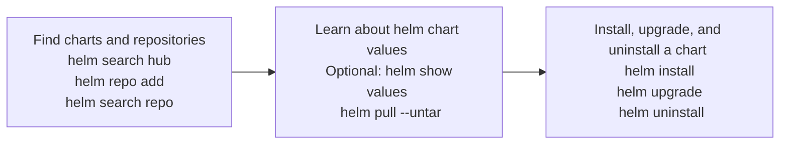

# Application Deployment

## Use Kubernetes primitives to implement common deployment strategies (e.g. blue/green or canary)

### Deployments

- Use `kubectl run` to run a single pod, for example:
  ```
  kubectl run busyapp --image=busybox
  ```
- Deployments use replicasets to deploy pods
- Services allow pods to talk to each other
- Deployments can be created imperatively or declaratively
- Two deployment approaches:
  - Blue/Green deployments check the viability of a deployment before making it publicly available
  - Canary Deployments deploy new application versions alongside stable versions
- Kubernetes Object: `kind: Deployment`
- The `selector:` is used to select the template to use based on the labels
- The `template:` is used to create the Pod/Containers
- Use dry-run to create boilerplate YAML files, e.g.
  `kubectl create deployment nginx --image=nginx:alpine --dry-run=client -o yaml > deploy.yml`
- ⭐ Scale a deployment imperatively: `kubectl scale deployment nginx --replicas=4`
- ⭐ Change an image imperatively: `kubectl set image deployment/nginx nginx`
- In a single line you can set the image and view the progress of the rollout:
  `k set image deployment.v1.apps/web-frontend -n hive nginx=nginx:1.17; k rollout status deployment/web-frontend -n hive`

### Blue/Green Deployments

- Blue/Green is a strategy for checking the viability of a deployment before it's made publicly available
- Runs two environments side by side, green for the new version, and blue for the old version (think greenfield for new)
- Use Kubernetes services for each environment
- Traffic is routed from blue to green when all the checks pass

  ```mermaid
  flowchart TD
    Users --> B[Public Service]
    B --> Blue
    B -. Switch Over .-> Green
  ```

  **Example Test Service (For testing new code):**

  ```yaml
  kind: Service
  apiVersion: v1
  metadata:
    name: blue-green-test-service # Private Service exposed to testers
    labels:
      env: blue # Blue service
  spec:
  type: LoadBalancer
  selector:
    app: nginx # Service will apply to Pods with these labels, note the role: Blue
    role: blue
  ports:
    - port: 9000 # Expose port on 9000 for testing, use 80 or whatever for prod
      targetPort: 80
  ```

  **Example Prod Service (For customers/users):**

  ```yaml
  kind: Service
  apiVersion: v1
  metadata:
    name: public-service # Public Service Exposed to users/customers
    labels:
      env: prod # Prod environment service
  spec:
  type: LoadBalancer
  selector:
    app: nginx # Service will apply to Pods with these labels, note the role: Blue
    role: blue
  ports:
    - port: 80 # Expose port on 80 for prod, use a different port for testing, e.g. 9000
      targetPort: 80
  ```

  **Example Deployment:**

  ```yaml
    apiVersion: apps/v1
    kind: Deployment
    metadata:
      name: blue-deployment
    spec:
      replicas: 2
      selector:
        matchLabels: # Apply to pods with these labels (note the role: blue)
        app: nginx
        role: blue
    template:
        metadata:
        labels: # Pod labels (note the role: blue)
            app: nginx
            role: blue
        spec:
        containers:
        - name: blue
            image: nginx
            ports:
            - containerPort: 80
  ```

- Changing from Blue to Green:
  - Declaratively:
  ```yaml
  selector:
    app: nginx
    role: green
  ```
  - ⭐ Imperatively:
  `kubectl set selector svc <service name> 'role=green'` 

### Canary Deployments

- The **Canary** deployment strategy involves deployment new versions of applications next to stable production versions to see how the canary version compares against the baseline version before promoting or rejecting the deployment
- You run two identical production deployments at the same time
- Canary deployment runs alongside existing stable Deployment
- Canary deployment is setup to receive minimal production traffic

  ```mermaid
  flowchart TD
      Users --> Service
      Service ==> C[Stable \n 4 Pods]
      Service --> D[Canary \n 1 Pod]
  ```

- Three components: Service, Stable Deployment and Canary Deployment

  **Service**

  ```yaml
  spec:
  selector:
    app: customer-app
  ```

  **Stable Deployment**

  ```yaml
  spec:
  replicas: 4
  ...
  template:
  metadata:
      labels:
      app: customer-app
      track: stable
      ...
  ```

  **Canary Deployment**

  ```yaml
  spec:
  replicas: 1
  ...
  template:
  metadata:
      labels:
      app: customer-app
      track: canary
      ...
  ```

- You can create services using `kubectl expose deployment <deployment name> --port=9000 --target-port=80 type=NodePort --name=nginx-svc`
- Using `kubectl expose deployment` automatically sets the selector to the `app` label for the deployment
- ⭐ Use `k edit` to edit objects directly without creating YAML files. `k edit` automatically does an apply, when you save the YAML

## Understand Deployments and how to perform rolling updates

### Performing rolling updates

- Deployments support two deployment strategies:

  - Rolling updates - **Default**, increasing new pods while decreasing old pods, without downtime
  - Recreate - Can lead to downtime, removes all current pods and re-deploys them

  **Example Code**

  ```yaml
  ---
  kind: Deployment
  spec:
    replicas: 4
    minReadySeconds: 1 # Default 0, seconds to wait for a pod to be healthy
    progressDeadlineSeconds: 60 # Default 600secs, number of seconds to wait for reporting the deployment is stalled
    revisionHistoryLImit: 5 # Default 10, number of replicasets that can be rolled back
    strategy:
      rollingUpdate: # RollingUpdate is the default, specify to customize, alternative is Recreate
        maxSurge: 1 # Default is 25%, Maximum number of pods that can be added above the replicaset during an update (depends on available resources)
        maxUnvailable: 1 # Default 25%, How many of the existing pods can be made unavailable during an update
  ```

- Use the `--save-config` parameter of `kubectl create` to save the configuration in a resource's annotation, when creating the resource, for example:

  ```
  kubectl create -f filename.yml --save-config
  ```

- When updating a resource, with `kubectl apply` use use `--record=true` to add the changes to the deployment history (Command may be removed in the future), for example:

  ```
  kubectl apply -f filename.yml --record=true
  ```

- Or alternatively, if `--record=true` doesn't work (due to deprecation):

  ```
  kubectl annotate deployment [name]
    kubernetes.io/change-cause="Change details" --overwrite=true
  ```

- Check the status of a rollout: `kubectl rollout status deployment [deployment name]`

- Set the image on a deployment using: `kubectl set image deploy [name] [appname]=[image name]`
- List a specific annotation: `kubectl get deployment -o json | jq '.metadata.annotations."kubernetes.io/change-cause"'`

### Rolling pack deployments

- Get the history of rollouts: `kubectl rollout history`
  - Get the history of a specificy revision, add: `--revision=2`
- Undo a rollout and go back: `kubectl rollout undo`
  - Go back to a specific revision: `kubectl rollout undo -f filname.yml --to-revision=2`

## Use the Helm package manager to deploy existing packages

### Helm Overview

- [Helm](https://helm.sh) is a package manager for kubernetes, it allows you to build, find, share and use software built for kubernetes
- Helm is a tool for managing Kubernetes packages called **Charts**
- Use the helm command-line client to install, upgrade, and uninstall kubernetes apps
- Find apps by searching helm chart repositories

### Helm Components

- **Chart**: A bundle of information used to create an instance of a kubernetes application
- **Config**: Configuration information that can be merged into a packaged chart to create a releasable product, basically chart parameters
- **Release**: The running instance of a chart (combined with a specific configuration) in Kubernetes

## Helm Commands

- Get help: `help -h`
- Find a repository: `helm search hub` Defaults to Artifact Hub
- Add a repository locally: `helm repo add`
- Search a repo: `helm search repo`
- Determine what default values (parameters) to customize: `helm show values`
- Install a package: `helm install`
- Get the status of an install: `helm status`
- List installs: `helm list`
- Uninstall a chart: `helm uninstall`

**Helm command workflow**



## Kustomize
