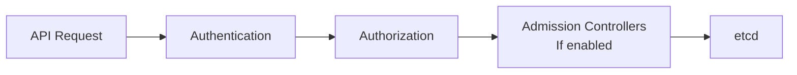
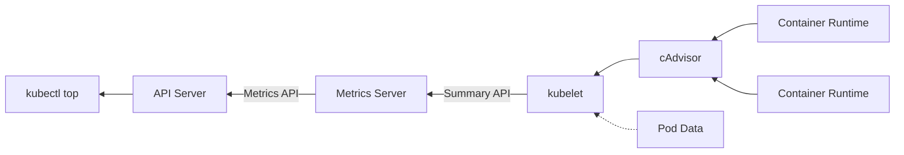

# Application Observability and Maintenance

## Understand API deprecations

- Key commands:
  ```shell
  k describe pod kube-apiserver -n kube-system | grep enable-admission-controllers
  cat /etc/kubernetes/manifests/kube-apiserver.yaml
  k api-resources --sort-by=name
  k api-versions
  k proxy 8001 & curl localhost:8001/apis/[API_GROUPNAME]
  k explain [RESOURCE_NAME]
  ```

### Understanding admission controllers

- An **admission controller** is a piece of code that intercepts requests to the Kubernetes API server prior to persistence of the object, but after the request is authenticated and authorized



- Admission controllers customize what dcan be run on a cluster, can be used to validate, mutate, or both
- Admission controllers limit requests to create, delete and modify, but **not** read
- Admission controlers can enforce security policies, e.g. block insecure images from running
- Admission controllers are built into the kube-api server binary
- Controller examples:
  - LimitRanger - Apply default pod memory/cpu limits for a namespace
  - PersistentVolumeClaimResize - Check incoming persistent volume claim size requests, prevents resizing of all claims by default
  - NamespaceAutoProvision - Examines requests and creates a namespace if it doesn't exist
- To view Admission Controller plugins:
  - Exists in the following file: `/etc/kubernetes/manifests/kube-apiserver.yaml`
  - View kube-apiserver configuration: `kubectl describe pod kube-apiserver -n kube-system`, and optionally grep `| grep enable-admission-plugins`
- To modify Admission Controller plugins:
  _ Modify `/etc/kubernetes/manifests/kube-apiserver.yaml` with `--enable-admission-plugins=NodeRestriction,NamespaceAutoProvision`
  _ Invoke `kube-apiserver --enable-admission-plugins=NodeRestriction,NamespaceAutoProvision` while shelled into a master node
  _ To shell into the API Server Master node, use `kubectl exec -it <pod name> -- <command to run on pod>`
  To turn off admission controller plugins:
  _ Invoke `kube-apiserver --disable-admission-plugins=NodeRestriction,NamespaceAutoProvision` while shelled into a master node

### Understanding API Groups and Versions

- Display the kubenetes version: `kubectl version -o yaml`
- An **API** can be used to extend the Kubernetes API and is used in the REST path as well as the apiVersion field of a resource:
  - Core group: `apiVersion v1`
  - Named groups: `batch/v1`
- List Kubernetes API Resources: `kubectl api-resources --sort-by=name`
  - Can also list by API group using the `--api-group=<name>`
- API Deprecation rules: [Deprecation Policy](https://kubernetes.io/docs/reference/using-api/deprecation-policy)
- View API group for a resource: `kubectl explain <resource name>`, for example: `kubectl explain deploy`
- Alpha versions must be enabled on the `api-server`
- Use `kubectl proxy` to enable calling into the APIs to view the preferred version for an API group, for example:
  ```
  kubectl proxy 8001
  curl localhost:8001/apis/certificates.k8s.io
  ```
  Make sure to kill the proxy process when you're done using it.

## Implement probes and health checks

### Understanding Probes and Health Checks

- Kubernetes relies on probes to determine the health of a pod container
- A Probe is a diagnostic performed periodically by the kubelet on a container - Its a type of health check
- Probe types:
  - Readiness Probe - Liveness probe determines if a Pod should receive requests
  - Liveness Probe - Liveness prob determines if a Pod is healthy and running as expected
  - (Legacy) Start-up Probe - Not often used, but is used with legacy containers that take a long time to start
- Liveness probe does not wait for the Readiness Probe, they run independently, so you might want a delay on the liveness probe
- Failed pod containers will be recreated by default due to the `restartpolicy` being set to `Always`
- Probe Types:
  - ExecAction: Executes an action inside a container
  - TCPSocketAction: TCP check against the contaienr's IP Address on a specified port
  - HTTPGetAction: HTTP GET request against a container
- Probe results:
  - Success
  - Failure
  - Unknown

### Working with Probes and Health Checks

- Readiness Probe YAML example:
  ```yaml
  apiVersion: v1
  kind: Pod
  ---
  spec:
    containers:
      - name: nginx
        image: nginx:apline
        readinessProbe:
          httpGet: # Probe type
            path: /
            port: 80
            initialDelaySeconds: 2 # Wait 2 seconds, default is zero
            periodSeconds: 5 # Wait for 5 seconds, default is 10
            failureThreshold: # Default of 3, will be marked as unready
  ```
- Liveness Probe YAML example:
  ```yaml
  apiVersion: v1
  kind: Pod
  ---
  spec:
    containers:
      - name: nginx
        image: nginx:apline
        livenessProbe:
          httpGet: # Probe type
            path: /
            port: 80
            initialDelaySeconds: 15 # Wait 2 seconds, default is zero
            periodSeconds: 5 # Wait for 5 seconds, default is 10
            failureThreshold: # Default of 3, will be marked as unready
  ```
- Liveness Probe with Exec example:
  ```yaml
  apiVersion: v1
  kind: Pod
  ...
  spec:
      containers:
      - name: liveness
        image: k8s.gcr.io/busybox
        livenessProbe:
          exec: # Probe type
              command: /
               - cat # Try and open ...
               - /tmp/healthy # This file
          initialDelaySeconds: 5
          periodSeconds: 5
  ```

## Use built-in CLI tools to monitor Kubernetes applications

- Monitoring options:
  - Web UI Dashboard
  - Metrics server
  - kube-state-metrics
  - Prometheus
  - Grafana (Dashboards/visualisations)
  - Many more...

### Understanding Metrics Server

- Metrics Server collects resource metrics from Kubelets and exposes them in Kubernetes apiserver through Metrics API for se by Horizontal Pod Autoscaler
- Metrics API can also be access by kubectl top, making it easier to debug autoscaling pipelines
- Metrics Server might need to be installed, for example when using Docker Desktop
- Metrics server can be used to monitor pods and nodes and for autoscaling



### Installing Metrics Server

- Search the docs for Metric Server, aka Resource metrics pipeline
- Go to the metrics server repository
- Install on DockerDesktop:
  1. Download components.yaml
  1. Add `--kubelet-insecure-tls` to the args to the mtrics server app container
  1. Install with `k apply components.yaml`
  1. Check for the metrics server pod `k get pods -n kube-system`
- Install on minikube:
  `minikube addon enable metrics-server`

### Working with the kubectl top Command

- `kubectl top nodes` used to scale out or up nodes
- `kubectl top pods` used to monitor pods
- There may be a delay in performance data being avaiable in top

## Utilize container logs

- Application logs can help you understand what is happening inside applications
- Logs are particularly useful for debugging problems and monitoring cluster activity
- Key troubleshooting commands:
  - kubectl get pod _pod name_ -o yaml
  - kubectl describe pod _pod name_
  - kubectl exec _pod name_ -it sh
- To view logs from resources, use `kubectl logs`:
  - View a specific pod with _pod name_
  - View a specific container in a pod with `-c container_name`
  - View logs for a deployment `kubectl logs deployment/deployment_name`
  - ⭐ Add the `-p` parameter to view logs for a past pod, deleted/restarted
    - For example: `kubectl logs -p -c [container name] [pod name]`
    - By default if a container restarts, the kubelet keeps one teriminated container
    - If a pod is evicted from the node, all corresponding containers are also evicted, along with their logs
  - ⭐ Add the `-f` parameter to follow logs for a pod/container
  - ⭐ Get the last x number of logs with `--tail=x`
  - ⭐ Get the logs for the last time interval with `--since=x` where x can be s for seconds, m for minutes and h for hours, e.g. 5s, 1m, 2h
  - To target a specific label, use `-l label=value` for example `-l app=backend`

## Debugging in Kubernetes

- ⭐ Describe a pod: `kubectl describe pod [pod-name]` including the output format `-o yaml`
- Change a deployment's output: `kubectl get deployment [deployment-name] -o wide`
  -⭐Get specific pod events: `kubectl get events --field-selector type=warning --all-namespaces`
- Get specific pod information: `kubectl get pods --namespace default -o jsonpath="{.spec.containers[*].image}"`
- Get Pod status information: `kubectl get pods --namespace default -o jsonpath="{.status.containerstatuses[*].ready}`
- ⭐Shell into a pod container: `kubectl exec [pod-name] -it -- sh`
- ⭐ When a pod container crashes and doesn't have debugging utilities, kubectl might not be much help, you can use `kubectl debug` to create a copy of a Pod with debugging utilities and change command:
  ```
  kubectl debug myapp -it --copy-to=myapp-debug --container=myapp -- sh
  ```
